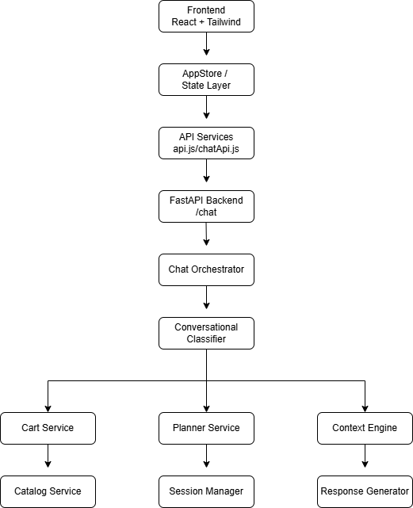
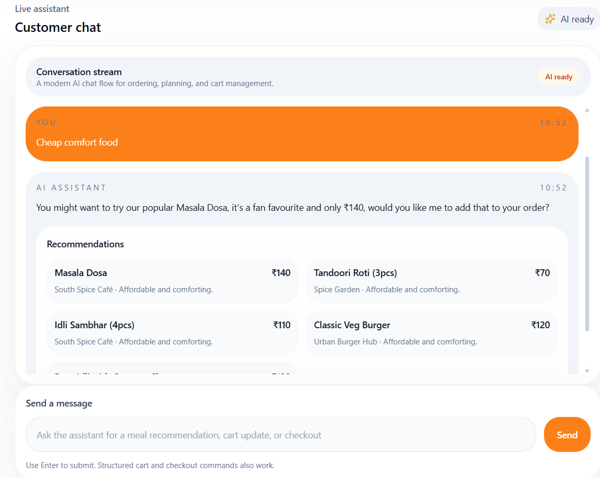
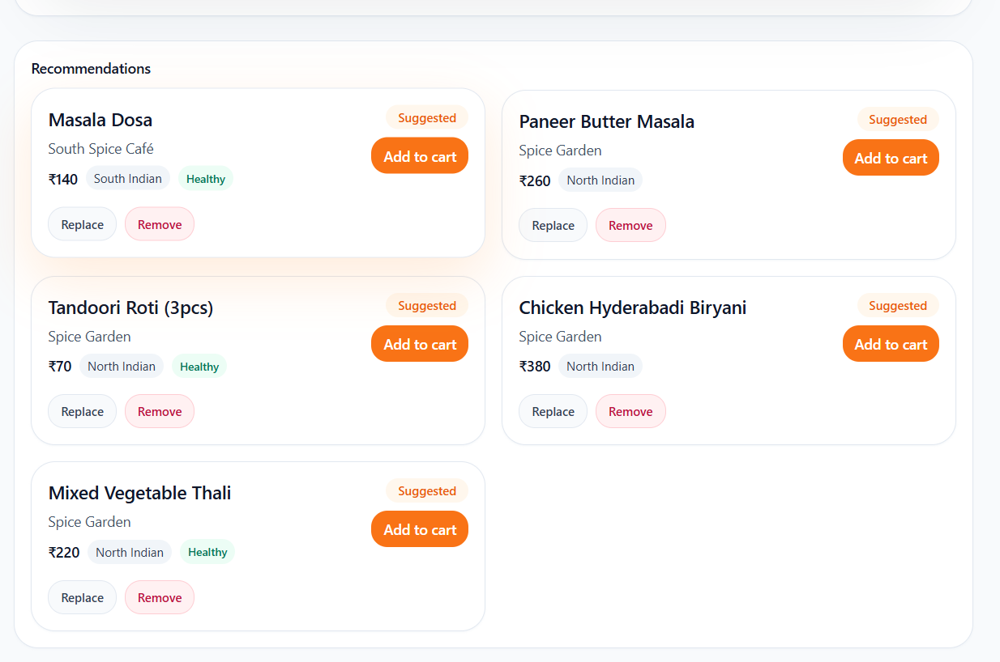
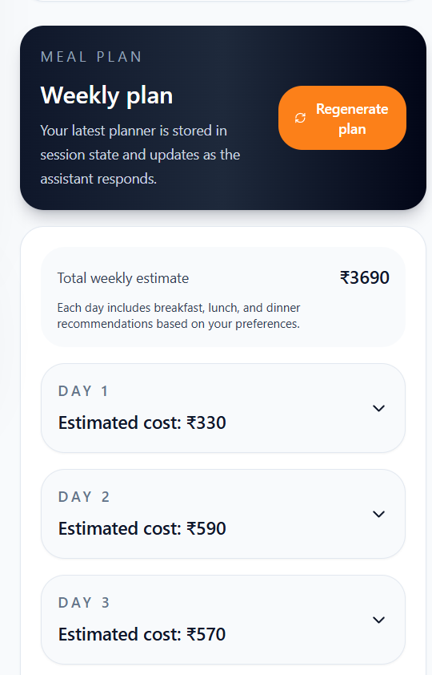
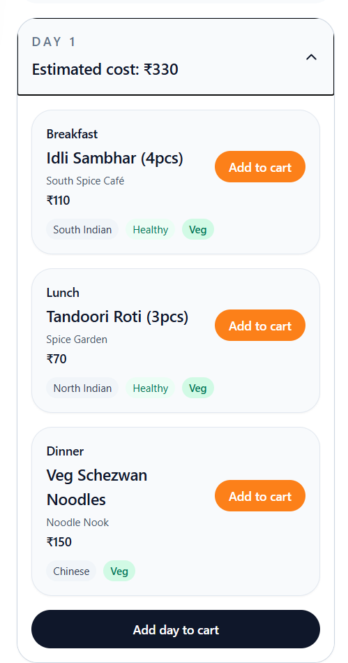
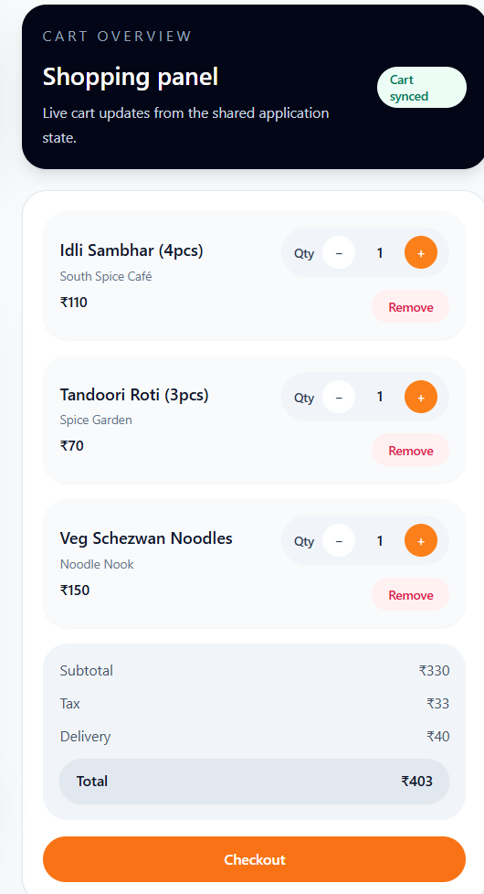

<div align="center">
  <h1>🍔 Swiggy AI Commerce Copilot</h1>
  <p>A conversational AI-powered commerce assistant for intelligent food discovery, meal planning, cart management, and conversational ordering.</p>

  <!-- Badges -->
  
  
  
  
</div>

<br />

Inspired by Swiggy-style conversational commerce workflows, this project bridges the gap between natural language interaction and deterministic e-commerce actions like cart updates, item filtering, and checkout flows.

---

## 🌐 Live Demo

| Service | URL |
|---|---|
| Frontend App | https://swiggy-agent.vercel.app/ |
| Backend API | https://swiggy-agent.onrender.com |

⚠️ Backend is hosted on Render free tier and may take a few seconds to wake up after inactivity.

---

## 🎥 Demo Video

Watch the complete walkthrough here:

[Demo Video Link](PASTE_LINK_HERE)

---


## ✨ Features

- 💬 **Conversational Food Ordering**: Order food using natural language instead of clicking through menus.
- 🛒 **Natural Language Cart Management**: Add, remove, and view cart items seamlessly ("remove the fries and add a burger").
- 🧠 **AI-Powered Recommendations**: Get smart suggestions based on budget, dietary preferences, and mood.
- 📅 **Weekly Meal Planning**: Automatically generate 7-day meal plans based on your health goals and budget.
- 💰 **Budget-Aware Suggestions**: Finds the best combinations under a specified price limit.
- 🥗 **Intelligent Dietary Filtering**: Robust veg/non-veg and health-goal filtering.
- 🔄 **Context-Aware Conversations**: Remembers previous requests so you can ask follow-ups ("make it cheaper").
- ⚡ **Dynamic Cart Synchronization**: App-wide shared state ensures the UI updates instantly when the AI changes the cart.
- 🎨 **Swiggy-Inspired UI**: Beautiful, responsive layout with a built-in Dark/Light mode.

---

## 🎯 Why This Project

Modern food ordering platforms are still heavily click-driven and fragmented.

This project explores the future of conversational commerce where users interact naturally with an AI assistant for:
- food discovery
- contextual recommendations
- meal planning
- conversational cart management
- intelligent order flows

The goal was to combine deterministic commerce operations with natural language AI interactions in a production-style architecture.

---


## 🏗️ Architecture



### 💻 Tech Stack

| Layer | Technologies |
| --- | --- |
| **Frontend** | React, TailwindCSS, Vite |
| **Backend** | FastAPI, Python |
| **AI/LLM** | Groq (Llama Models) |
| **Deployment** | Vercel (Frontend), Render (Backend) |

---

## 🧠 System Design Principles

- Deterministic business logic
- LLM-assisted conversational understanding
- Shared global frontend state
- Modular backend services
- Context-aware orchestration
- Separation between AI reasoning and transactional logic

---

## 📂 Folder Structure

```text
swiggy-agent/
├── frontend/
│   ├── assets/              # Static assets (images, icons)
│   ├── src/
│   │   ├── components/      # UI Components (Chat UI, Recommendation Cards, Planner)
│   │   ├── store/
│   │   │   └── AppStore.jsx # App-wide shared state management
│   │   ├── services/
│   │   │   ├── api.js       # Core API client
│   │   │   └── chatApi.js   # Chat specific API integration
│   │   └── App.jsx
│   ├── vercel.json          # Vercel deployment & routing config
│   └── package.json
└── backend/
    ├── app/
    │   ├── main.py          # FastAPI application entry point
    │   ├── routes/          # API routes (e.g., /chat)
    │   └── services/        # Core business & AI logic
    │       ├── chat_orchestrator.py
    │       ├── cart_service.py
    │       ├── catalog_service.py
    │       ├── planner.py
    │       ├── context_engine.py
    │       ├── session_manager.py
    │       ├── conversational_classifier.py
    │       ├── conversational_response_generator.py
    │       ├── goal_engine.py
    │       ├── history_analyzer.py
    │       └── order_service.py
    └── requirements.txt
    └── render.yaml          # Render Blueprint for automated deployment
```

---

## ⚙️ How It Works

### Backend Architecture
The backend is powered by a modular FastAPI architecture designed for deterministic e-commerce interactions layered with LLM intelligence. 

- **Chat Orchestrator (`chat_orchestrator.py`)**: The central brain. It receives user messages, routes them to the classifier, and coordinates the execution of business logic (cart, orders, planning) before returning a response.
- **Conversational Classifier**: Uses an LLM to accurately detect intents (e.g., `add_to_cart`, `food_recommendation`, `meal_planning`), extract entities (budget, preferences), and identify multi-action workflows or follow-ups.
- **Business Services (`cart_service`, `order_service`, `planner`)**: Deterministic functions that safely manipulate state and data, ensuring that an LLM hallucination cannot corrupt a user's cart or order.
- **Response Generator**: Formulates natural, human-like responses while appending the structured data (cart updates, recommendations) for the frontend to render.

### Frontend Architecture
The frontend is a snappy Vite + React application styled with TailwindCSS.

- **AppStore (`AppStore.jsx`)**: Manages global state, specifically the synchronization of the cart. When the backend AI says "Added to cart", the AppStore updates the UI globally without requiring a page refresh.
- **Chat UI**: A specialized chat interface capable of rendering not just text, but complex interactive components like Recommendation Cards and Weekly Meal Planners directly inline.

### Conversational Workflow
1. **User Intent**: User types _"show me healthy non-veg dinner under 300, and remove fries from my cart"_.
2. **Classification**: The backend `conversational_classifier` detects two intents: `food_recommendation` and `remove_from_cart`. It extracts entities: `{ "health_goal": true, "preference": "non-veg", "meal_type": "dinner", "budget_max": 300 }`.
3. **Execution**: The orchestrator triggers `cart_service` to remove the fries, and `context_engine` to fetch the dinner options.
4. **Generation**: `conversational_response_generator` creates a natural reply: _"I've removed the fries. Here are some healthy non-veg dinner options under ₹300!"_
5. **UI Update**: The frontend receives the text, updates the cart badge via `AppStore`, and displays the recommendation cards.

---

## 🔄 End-to-End Flow

User Prompt  
→ Conversational Classifier  
→ Chat Orchestrator  
→ Business Services (Cart / Planner / Recommendations)  
→ Conversational Response Generator  
→ Frontend State Synchronization  
→ Dynamic UI Rendering

---

## 🚀 Setup Instructions

### 1. Backend Setup

```bash
cd backend

# Create a virtual environment (optional but recommended)
python -m venv venv
source venv/bin/activate  # On Windows: venv\Scripts\activate

# Install dependencies
pip install -r requirements.txt

# Run the FastAPI server
uvicorn app.main:app --reload
```
The backend will run on `http://localhost:8000`.

### 2. Frontend Setup

```bash
cd frontend

# Install dependencies
npm install

# Start the development server
npm run dev
```
The frontend will be available at `http://localhost:5173`.

---

## 🔐 Environment Variables

Create a `.env` file in the `backend/` directory:

```env
GROQ_API_KEY=your_groq_api_key_here
GROQ_MODEL=llama-3.3-70b-versatile
```

Create a `.env` file in the `frontend/` directory (if required for API configuration):

```env
VITE_API_BASE_URL=http://localhost:8000
```

---

## 💬 Example Queries

Try pasting these into the chat:
- **Discovery:** _"I want some healthy non-veg options for dinner under 400."_
- **Follow-up:** _"Show me something cheaper."_
- **Cart Operations:** _"Add the chicken salad to my cart."_
- **Multi-Action:** _"Remove the salad and add a paneer wrap instead."_
- **Meal Planning:** _"Create a high protein meal plan for the week."_
- **Checkout:** _"Show my cart" -> "Checkout my order."_

---

## 📸 Screenshots

| Chat Interface | Recommendations |
| :---: | :---: |
|  |  |
| **Meal Planner** | **Cart Management** |
| <br> |  |

---

## 🔮 Future Improvements

- [ ] Stateful conversational planner mutations
- [ ] Multi-action conversational execution graphs
- [ ] Persistent cross-session memory
- [ ] Voice-based conversational ordering
- [ ] Real payment gateway integration
- [ ] Personalized recommendation engine
- [ ] PostgreSQL-backed persistent user profiles
- [ ] Real-time order tracking workflows
- [ ] Dynamic AI nutrition optimization
- [ ] Agentic proactive meal recommendations
---

## 📄 License

This project is licensed under the MIT License - see the LICENSE file for details.

---

## 👨‍💻 Author

Built with ❤️ by **Harsh Upadhyay**

- GitHub: https://github.com/HarshUpadhyay2003
- LinkedIn: https://www.linkedin.com/in/harshadhyay2003/