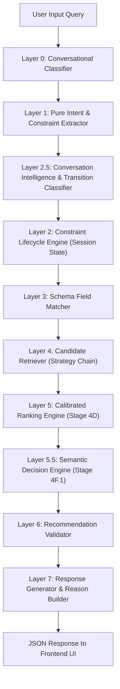

<div align="center">
  <h1>🍔 CraveAI — Swiggy AI Commerce Copilot</h1>
  <p>A production-ready, layer-isolated conversational AI assistant for food discovery, multi-constraint recommendation, meal planning, and automated checkout.</p>

  <!-- Badges -->
  
  
  
  
  
  
  
  
</div>

<br />

The **Swiggy AI Copilot (CraveAI)** bridges natural language conversation and deterministic food e-commerce. Powered by an 8-layer isolated recommendation pipeline (Layers 0–7) with Stage 4D calibrated ranking, Layer 2.5 conversation intelligence, and Stage 4F.1 semantic decision evaluation, it translates ambiguous user prompts into structured food recommendations, cart updates, meal plans, and automated checkout flows.

---

## 🌐 Live Services

| Component | Target Endpoint |
|---|---|
| **Frontend Web Application** | [https://swiggy-agent.vercel.app/](https://swiggy-agent.vercel.app/) |
| **Backend API Service** | [https://swiggy-agent.onrender.com](https://swiggy-agent.onrender.com) |
| **Health Check API** | [https://swiggy-agent.onrender.com/health](https://swiggy-agent.onrender.com/health) |
| **Version API** | [https://swiggy-agent.onrender.com/version](https://swiggy-agent.onrender.com/version) |

---

## ✨ Key Features

- 💬 **Multi-Turn Conversational Ordering**: Conversational food discovery, multi-turn refinements (`"make it under ₹200"`), domain switches, and general intent handling.
- 🎯 **8-Layer Isolated Recommendation Engine**: Strict execution pipeline isolating Intent Classification, Context Extraction, State Lifecycle, Schema Matching, Candidate Retrieval, Calibrated Ranking, Semantic Decision Evaluation, Validation, and Response Generation.
- 🧠 **Layer 2.5 Conversation Intelligence**: Deterministic 5-way transition classification (`NEW_SEARCH`, `REFINEMENT`, `DOMAIN_SWITCH`, `RECOVERY`, `CLARIFICATION`) ensuring stale search parameters are automatically cleared when starting a new query while preserving persistent user preferences.
- 📊 **Stage 4D Calibrated Ranking (Layer 5)**: 5-dimensional candidate scoring across Intent Match (50%), Budget (20%), Catalog Relevance (20%), Nutrition (5%), and Commerce Signals (5%).
- 🛡️ **Stage 4F.1 Semantic Decision Engine (Layer 5.5)**: Adaptive decision boundaries enforcing domain boundaries and eliminating cuisine leakage (e.g. preventing burgers/pizzas in Indian cuisine requests).
- 🛒 **Conversational Cart Operations**: Add, modify, clear, and checkout items directly via chat or interactive UI drawers.
- 📅 **AI Meal Planner**: Generate multi-day meal plans matching dietary constraints and nutrition targets.
- 🚀 **Production-Ready Endpoints**: `/health` and `/version` APIs for operational monitoring.

---

## 🏗️ System Architecture



### Recommendation Pipeline Overview

1. **Layer 0 (Classifier)**: Classifies high-level user intent (`food_recommendation`, `meal_planning`, `cart_action`, `casual_chat`).
2. **Layer 1 (Extractor)**: Pure extraction of explicit constraints (`cuisine`, `budget`, `diet`, `category`, `taste`) from text without state mutation.
3. **Layer 2.5 (Conversation Intelligence)**: Classifies transition type, clears session recommendation context on `NEW_SEARCH`, and preserves persistent user preferences.
4. **Layer 2 (State Lifecycle)**: Merges active session memory with incoming constraints to build `EffectiveRecommendationRequest`.
5. **Layer 3 (Schema Matcher)**: Maps domain constraints to catalog fields.
6. **Layer 4 (Candidate Retriever)**: Filters catalog items using strategy chains.
7. **Layer 5 (Calibrated Ranker)**: Computes 5-dimensional candidate scores.
8. **Layer 5.5 (Semantic Evaluator)**: Applies profile-specific semantic suitability thresholds.
9. **Layer 6 (Validator)**: Enforces hard constraint satisfaction.
10. **Layer 7 (Response Generator)**: Formulates natural language explanations and payload responses.

---

## 🛠️ Technology Stack

- **Frontend**: React 18, Vite 5, TailwindCSS 3.4, Lucide Icons, AppStore custom context engine.
- **Backend**: Python 3.10+, FastAPI 0.100+, Pydantic V2, Uvicorn.
- **AI & NLP**: Groq SDK (Llama 3.3 70B Versatile), custom regex & schema matchers.
- **Deployment**: Render (Backend Web Service), Vercel (Frontend Single Page Application).
- **Testing**: Python `unittest`, custom calibration suites, diagnostic telemetry runners.

---

## 📂 Project Structure

```text
swiggy-agent/
├── assets/                     # Production brand assets & logos
│   └── logo/                   # Brand logo files
├── backend/
│   ├── app/
│   │   ├── config/             # Centralized Settings & App Config
│   │   ├── models/             # Pydantic Schemas & DTOs
│   │   ├── routes/             # FastAPI Endpoint Routers (/chat, /health, /version)
│   │   ├── services/           # Recommendation Engine, Layer 2.5, KB Services
│   │   └── main.py             # FastAPI Entry Point
│   ├── config/                 # Production Configuration Package
│   ├── data/                   # Menu Knowledge Base & Catalog Datasets
│   ├── tests/                  # Test Suites & Calibration Runners
│   │   ├── run_backend_tests.py            # Master Unit & Integration Test Runner
│   │   ├── test_rc1_conversation_policy.py # RC1 Policy Test Suite
│   │   ├── stage4f1_calibration_test.py    # Semantic Calibration Suite
│   │   └── diagnostics/                    # Deep Audit Scripts
│   └── archive/                # Archived Scratch Scripts & Legacy Utilities
├── docs/                       # Comprehensive Documentation Suite
│   ├── Architecture.md         # 8-Layer Pipeline Architecture Spec
│   ├── API.md                  # Endpoint API Contracts
│   ├── Deployment.md           # Render & Vercel Hosting Guide
│   ├── DeveloperGuide.md       # Standards & Module Documentation
│   ├── Testing.md              # Test Runner & Validation Metrics
│   ├── ReleaseNotes.md         # Stage 3 through Stage RC-1.1 Recap
│   ├── Roadmap.md              # Post-Demo Roadmap
│   ├── ManualAcceptance.md     # Manual Acceptance Verification Script
│   └── archive/                # Archived Historical Stage Notes & Plans
├── frontend/                   # React + Vite Web Application
│   └── src/
│       ├── components/         # UI Components (Cart, Chat, Navbar, Planner)
│       ├── store/              # Centralized AppState & AppActions Store
│       └── assets/             # Bundled Frontend Assets
├── render.yaml                 # Backend Deployment Specification
├── requirements.txt            # Python Dependencies
├── package.json                # Frontend Dependencies & Scripts
└── README.md                   # Project Overview & Setup Guide
```

---

## 🚀 Local Installation & Setup

### Prerequisites
- Python 3.10 or higher
- Node.js 18 or higher

### 1. Start Backend API Server
```bash
cd backend
python -m venv venv

# Windows:
.\venv\Scripts\activate
# Linux/macOS:
source venv/bin/activate

pip install -r requirements.txt
uvicorn app.main:app --reload --port 8000
```
Backend API will run at `http://localhost:8000`. Test interactive docs at `http://localhost:8000/docs`.

### 2. Start Frontend Web Application
```bash
cd frontend
npm install
npm run dev
```
Frontend web app will run at `http://localhost:5173`.

---

## 🧪 Testing & Validation

Run the automated backend test suites:

```bash
# Run Master Backend Test Suite (41 tests)
python backend/tests/run_backend_tests.py

# Run RC1 Conversation Policy Test Suite (9 tests)
python backend/tests/test_rc1_conversation_policy.py

# Run Stage 4F.1 Semantic Calibration Suite (9 tests)
python backend/tests/stage4f1_calibration_test.py
```

---

## 📖 Documentation Index (`docs/`)

- [Architecture](docs/Architecture.md) — 8-Layer isolation design & state lifecycle.
- [API Reference](docs/API.md) — Endpoint specifications (`POST /chat`, `/health`, `/version`).
- [Deployment Guide](docs/Deployment.md) — Production deployment instructions.
- [Developer Guide](docs/DeveloperGuide.md) — Architecture conventions & code organization.
- [Testing Guide](docs/Testing.md) — Automated test suite details & metrics.
- [Release Notes](docs/ReleaseNotes.md) — Stage 3 through RC-1.1 release summary.
- [Manual Acceptance Script](docs/ManualAcceptance.md) — 5-scenario acceptance script.
- [Future Roadmap](docs/Roadmap.md) — Post-V1 future feature roadmap.

---

## 🔮 Capabilities & Future Roadmap

### Current Version 1 Capabilities
- Full 8-layer isolated recommendation pipeline.
- Multi-turn conversation intelligence with automatic context clearing on new searches.
- Calibrated 5D ranking and adaptive semantic evaluation.
- Conversational cart additions and automated checkout flows.
- Meal planning with dietary constraints.

### Planned Post-V1 Work (Future Features)
- Hybrid vector/dense semantic retrieval (FAISS / Qdrant).
- Backend-driven personalized cart recommendation APIs.
- Long-term multi-session user profile persistence.
- Learning from implicit feedback and order history.

---

## 📝 License
This project is licensed under the MIT License - see the [LICENSE](LICENSE) file for details.