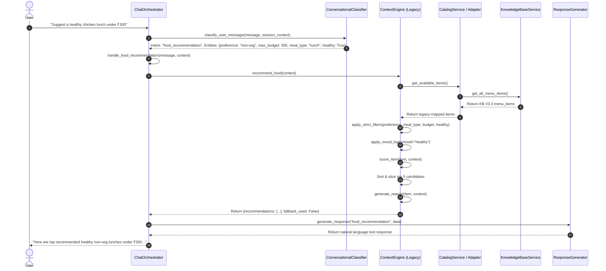

# Current Recommendation & Selection Architecture Audit (Pre-DecisionEngine)

> **Document Type:** Architectural Analysis & Decision Engine Roadmap  
> **Target System:** Swiggy AI Commerce Copilot Backend  
> **Knowledge Base Version:** 3.3.0  
> **Phase:** Stage 2 Pre-Implementation Analysis  
> **Status:** Read-Only Audit (Zero Code Modified)  

---

## 1. EXECUTIVE OVERVIEW

This document provides a comprehensive architectural analysis of how food recommendations, meal selections, and decision logic currently flow through the Swiggy AI Commerce Copilot backend.

With Stage 1 (Knowledge Base V3.3 Migration & Adapter Layer) completed, the backend safely consumes multi-domain datasets (`restaurants.json`, `menu_items.json`, `combos.json`, `category_registry.json`). However, food recommendation and decision logic currently remains fragmented across `context_engine.py`, `planner.py`, `cart_service.py`, and `chat_orchestrator.py`.

In **Stage 2**, this decision-making responsibility will be unified under a single **Decision Engine**. The Decision Engine will not only recommend food items, but will orchestrate:
1. Candidate retrieval & multi-vector ranking
2. Trade-off reasoning (e.g., budget vs. health vs. speed)
3. Smart combo & add-on suggestions
4. Follow-up question decisioning
5. Natural language decision explanations leveraging rich KB V3.3 metadata

---

## 2. COMPONENT-BY-COMPONENT ANALYSIS

### 2.1 `context_engine.py`

#### Responsibility
Serves as the primary recommendation scoring and filtering engine for food recommendations.

#### Public Methods
- `filter_by_budget(items, min_budget, max_budget)`
- `filter_by_preference(items, preference)`
- `filter_by_meal_type(items, meal_type)`
- `filter_by_healthy(items, healthy)`
- `prioritize_healthy(items)`
- `apply_mood_logic(items, mood)`
- `score_item(item, mood, context)`
- `generate_reason(item, context)`
- `recommend_food(context, include_scores)`

#### Recommendation Participation
`recommend_food()` orchestrates strict filtering (`apply_strict_filters`), multi-stage fallback filtering, mood scoring (`apply_mood_logic`), health prioritization (`prioritize_healthy`), scoring (`score_item`), top-5 selection, and reason generation (`generate_reason`).

#### Business Rules Contained
- **Strict Filtering:** Budget bounds, veg/non-veg preference, meal type (`breakfast`/`lunch`/`dinner`/`snacks`), health goal (`overall_health_score >= 6.0`).
- **Fallback Hierarchy:** If strict filters yield 0 results:
  1. Drop `meal_type` constraint (keep preference + budget + health).
  2. Drop `health_goal` constraint (keep preference + budget).
  3. If still 0, return fallback reason ("No meals found under ₹X").
- **Mood Keywords & Penalties:**
  - `comfort`: Boosts `biryani`, `burger`, `dosa`, `noodle`, `fries`; penalizes `salad`, `smoothie`, `quinoa`.
  - `healthy`: Boosts `salad`, `grilled`, `smoothie`, `protein`, `quinoa`; penalizes `fried`, `biryani`, `burger`.
  - `late night`: Boosts `snacks`, `wrap`, `momos`, `roll`, `fries`; penalizes `salad`, `heavy`, `lunch`.
- **Heuristic Scoring System:**
  - `healthy: True` -> $+20$ points
  - `preference` match -> $+15$ points
  - `meal_type` match -> $+10$ points
  - `mood` match -> $+20$ points; `mood` penalty -> $-15$ points
  - `max_budget` match -> $+10$ points + bonus based on price fraction
  - `protein_rich` & `high_protein` -> $+20$ points
  - `spicy` match -> $+15$ points
  - `vegan` match -> $+20$ points
  - `low_calorie` match -> $+20$ points
  - `gluten_free` match -> $+20$ points

#### External Service Calls
Calls `self.catalog_service.get_available_items()`.

#### Delegation to Decision Engine
`recommend_food()`, `score_item()`, `generate_reason()`, `apply_mood_logic()`, and filtering methods should be encapsulated inside `DecisionEngine`.

---

### 2.2 `planner.py` (`MealPlanner`)

#### Responsibility
Generates structured 7-day meal plans and performs surgical plan modifications.

#### Public Methods
- `generate_meal_plan(user_input)`
- `build_prompt(user_input)`
- `validate_plan_structure(plan)`
- `modify_existing_plan(existing_plan, entities, raw_message, user_preferences)`
- `generate_fallback_plan(user_input, daily_budget)`

#### Recommendation & Selection Participation
`_catalog_items()`, `_select_varied_item()`, `_find_item_by_name()`, `_structure_meal_item()`, `modify_existing_plan()`, and `generate_fallback_plan()` query the catalog and select candidate items for each day's breakfast, lunch, and dinner.

#### Business Rules Contained
- **Meal Type Allocation:** Breakfast max price allocation, lunch filling meal requirement, dinner balanced portion.
- **Variety Scoring & Repetition Penalties:**
  - Used `item_id` in same plan -> $+1000$ penalty.
  - Used `cuisine` frequency -> $+\text{freq} \times 50$ penalty.
  - Used `restaurant_name` frequency -> $+\text{freq} \times 50$ penalty.
  - Breakfast price $> 150$ -> $+100$ penalty.
  - Lunch price $< 100$ -> $+50$ penalty.
  - Dinner price $> 300$ -> $+50$ penalty.
- **Surgical Modification Rules:**
  - Cheaper substitution constraint: forces new meal max price to be $\le 80\%$ of current meal price.
  - Healthier substitution constraint: enforces `healthy_only=True`.
  - Item removal rule: replaces meal with `{"name": "Skipped", "price": 0}`.

#### External Service Calls
- Calls `GroqService.generate_json_response()` for LLM 7-day plan generation.
- Calls `self.catalog_service.get_available_items()`.

#### Delegation to Decision Engine
Item selection (`_select_varied_item`), item matching (`_find_item_by_name`), and item replacement candidate ranking should delegate item choice to `DecisionEngine`.

---

### 2.3 `chat_orchestrator.py`

#### Responsibility
Central routing engine, intent classification, context aggregation, and final response text formatting.

#### Recommendation & Selection Participation
- `handle_food_recommendation()`: Extracts recommendation context and calls `ContextEngine.recommend_food()`.
- `_handle_context_aware_followup()`: Tracks context stickiness across turns (e.g. "make it cheaper" modifies `budget_max` and re-invokes recommendations).
- `handle_reorder_action()`: Selects items from previous orders and matches catalog availability.

#### Business Rules Contained
- Context extraction heuristics (`_extract_recommendation_context`): Maps price terms ("under 200" -> `max_budget: 200`).
- Conversational follow-up domain locking & fallback rules.

#### External Service Calls
Calls `CatalogService`, `ContextEngine`, `MealPlanner`, `CartService`, `OrderService`, `ActionExecutor`, `ConversationalClassifier`, `ConversationalResponseGenerator`.

#### Delegation to Decision Engine
Routing decisioning ("should we answer, ask a clarifying question, or recommend a combo?") will be governed by `DecisionEngine`.

---

### 2.4 `catalog_service.py` & `catalog_adapter.py`

#### Responsibility
Retrieves and maps KB V3.3 datasets into legacy catalog format.

#### Recommendation Participation
Provides `get_available_items()`, `search_items()`, `get_item_by_id()`, `get_budget_meals()`, `get_healthy_items()`, `get_items_by_preference()`, `get_items_by_meal_type()`.

#### Delegation to Decision Engine
Remains the core data provider. `DecisionEngine` will consume `KnowledgeBaseService` and `CatalogService`.

---

## 3. COMPLETE RECOMMENDATION & DECISION CALL GRAPH



---

## 4. INVENTORY OF RECOMMENDATION RULES

| Rule Name | Target Domain | Trigger Condition | Logic / Action | Source File |
| :--- | :--- | :--- | :--- | :--- |
| **Availability Guard** | Catalog | Always | `item.get("available") is True` | `catalog_service.py` |
| **Budget Ceiling** | Filtering | `max_budget` set | `item.price <= max_budget` | `context_engine.py` |
| **Budget Floor** | Filtering | `min_budget` set | `item.price >= min_budget` | `context_engine.py` |
| **Dietary Preference** | Filtering | `preference` in (`veg`, `non-veg`) | `item.category == preference` | `context_engine.py` |
| **Meal Type Match** | Filtering | `meal_type` set | `item.meal_type == meal_type` | `context_engine.py` |
| **Health Goal Threshold** | Filtering | `health_goal` is `True` | `item.healthy is True` (`health_score >= 6.0`) | `context_engine.py` |
| **Meal Type Fallback** | Fallback | Strict filters yield 0 items | Drop `meal_type` filter | `context_engine.py` |
| **Health Fallback** | Fallback | Preference + Budget yield 0 items | Drop `health_goal` filter | `context_engine.py` |
| **Comfort Mood Scoring** | Ranking | Mood contains "comfort" | $+20$ for biryani/burger/noodle; $-15$ for salad/quinoa | `context_engine.py` |
| **Healthy Mood Scoring** | Ranking | Mood contains "healthy" | $+20$ for salad/grilled/quinoa; $-15$ for fried/burger | `context_engine.py` |
| **Late Night Scoring** | Ranking | Mood contains "late night" | $+20$ for snacks/wrap/fries; $-15$ for heavy/lunch | `context_engine.py` |
| **Protein Rich Boost** | Ranking | `protein_rich` in context | $+20$ if `high_protein is True` | `context_engine.py` |
| **Spicy Preference Boost**| Ranking | `spicy` in context | $+15$ if item matches spice preference | `context_engine.py` |
| **Planner Item Repetition**| Variety | Same `item_id` in 7-day plan | $+1000$ penalty | `planner.py` |
| **Planner Cuisine Repetition**| Variety | Same `cuisine` in 7-day plan | $+\text{freq} \times 50$ penalty | `planner.py` |
| **Cheaper Modification** | Plan Edit | "cheaper" requested | Max price $\le 80\%$ of current price | `planner.py` |

---

## 5. DETERMINISTIC VS. LLM-GENERATED LOGIC MATRIX

```text
User Input Message
       │
       ▼
┌─────────────────────────────────────────────────────────┐
│              LLM-GENERATED LOGIC (Groq)                 │
│ 1. Conversational Intent Classification                 │
│ 2. Entity Extraction (budget, preference, meal_type)    │
│ 3. Initial 7-Day Meal Plan Text Generation              │
│ 4. Conversational Response Polishing & Tone Selection   │
└────────────────────────────┬────────────────────────────┘
                             │
                             ▼
┌─────────────────────────────────────────────────────────┐
│                 DETERMINISTIC LOGIC (Python)            │
│ 1. Strict & Fallback Filter Chains                      │
│ 2. Mood & Attribute Mathematical Scoring                │
│ 3. Variety & Repetition Penalty Calculations            │
│ 4. Cart Subtotal, Delivery Fee & Tax Calculations       │
│ 5. Exact O(1) Index Lookups & Referential Audits        │
└────────────────────────────┴────────────────────────────┘
```

---

## 6. KNOWLEDGE BASE V3.3 METADATA CONSUMPTION AUDIT

### Currently Consumed Metadata Fields
- `price`
- `dietary_safety.is_veg` / `is_non_veg`
- `health_scores.overall_health_score`
- `available`
- `name`
- `primary_cuisine`
- `delivery_time_mins`

### Currently UNUSED Rich Metadata Fields (Gold Mine for DecisionEngine!)
1. **Confidence Vectors (`confidence`):** `score`, `type`, `reason`, `source`, `calculation_method`. (Can be used to prioritize official data over estimated values).
2. **Multi-Vector Health Scores (`health_scores`):** `weight_loss_score`, `muscle_gain_score`, `heart_health_score`, `gut_health_score`, `diabetic_friendly_score`, `satiety_score`, `recovery_score`. (Allows targeted health goal recommendations).
3. **Sensory & Mood Tags (`mood_sensory`):** `spice_level`, `mood_tags`, `comfort_score`. (Enables precise mood alignment beyond keyword regex).
4. **Trade-Off Reasoning (`ai_metadata`):** `health_tradeoffs`, `budget_tradeoffs`, `explanation_templates`, `recommended_for`, `avoid_if`. (Enables explainable AI recommendations).
5. **Combos & Upsells (`commerce_intelligence`):** `best_side_item_ids`, `best_beverage_item_ids`, `best_dessert_item_ids`, `recommended_combo`, `healthy_combo`, `budget_combo`, `combos.json`. (Enables smart combo upselling).
6. **Popularity & Social Proof (`commerce_intelligence`):** `popularity_percentile`, `popularity_score`. (Enables trending item boosts).
7. **Context & Environment (`context_intelligence`):** `context_tags`, `suitable_occasions`, `eating_environment`. (Enables office vs home vs party dining recommendations).
8. **Item Logistics (`commerce_intelligence`):** `delivery_suitability`, `reheating_quality`, `messiness_score`, `shareability_score`. (Enables late-night / office-suitable filtering).

---

## 7. DUPLICATED LOGIC & REFACTORED RESPONSIBILITY MAP

| Logic / Capability | Current Locations | Targeted Stage 2 Home |
| :--- | :--- | :--- |
| **Item Search & Name Matching** | `catalog_service.py`, `planner.py`, `cart_service.py` | `KnowledgeBaseService` search indexes |
| **Veg/Non-Veg & Budget Filtering** | `context_engine.py`, `planner.py` | `DecisionEngine.candidate_retriever` |
| **Item Variety & Candidate Scoring** | `context_engine.py`, `planner.py` | `DecisionEngine.ranking_engine` |
| **Recommendation Reason Generation** | `context_engine.py` | `DecisionEngine.explanation_engine` |
| **Trade-Off Analysis** | Not implemented | `DecisionEngine.tradeoff_analyzer` |
| **Combo & Add-On Selection** | Not implemented | `DecisionEngine.combo_orchestrator` |

---

## 8. STAGE 2 ROADMAP: DECISION ENGINE ARCHITECTURE

In Stage 2, we will introduce `DecisionEngine` as a unified service orchestrating:

```text
backend/app/services/decision_engine/
├── __init__.py
├── decision_engine.py         # Main Orchestrator & Public API
├── candidate_retriever.py     # Multi-stage deterministic filtering over KB V3.3
├── ranking_engine.py          # Multi-vector scoring (Health, Mood, Popularity, Context)
├── tradeoff_analyzer.py       # Health vs Budget vs Speed trade-off evaluator
├── combo_orchestrator.py      # Smart combo & add-on pairing selector
└── explanation_engine.py      # Natural language explainable AI decision generator
```

---
*End of Current Recommendation Architecture Audit Document.*
