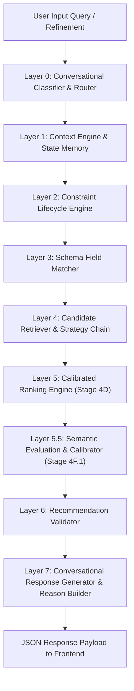

# Swiggy AI Copilot — System Architecture (Stage RC-1)

## Overview
The **Swiggy AI Copilot** is a high-performance, layer-isolated conversational recommendation engine built using **FastAPI**, **Pydantic**, and **Groq LLM (Llama 3.3 70B)**.

The system processes natural language queries for food ordering, transforms them into structured constraint representations, retrieves candidates, scores them using multi-dimensional ranking, calibrates semantic relevance, and formats conversational responses.

---

## High-Level Pipeline Flow

---

## Layer Isolation Principles

### Layer 0: Conversational Classifier
- Classifies user intent (`RECOMMENDATION`, `ADD_TO_CART`, `MODIFY_CART`, `CHECKOUT`, `RESET`, `AMBIGUOUS`).
- Extracts raw slot entities.

### Layer 1: Context Engine & Memory
- Maintains `RecommendationContextMemory` across multi-turn sessions.
- Tracks active domain, intent scope, and session state.

### Layer 2: Constraint Lifecycle Engine
- Manages constraint lifetime (`SESSION`, `PERSISTENT`, `TRANSIENT`).
- Resolves conflicting constraints and manages domain-switch reset policies.

### Layer 3: Schema Field Matcher
- Maps user-level constraints to catalog schema attributes (e.g. `preference=veg` → `category_intelligence.category_id`, `dietary_safety`).

### Layer 4: Candidate Retriever & Strategy Chain
- Filters 60+ catalog items down to relevant candidate sets.
- Employs fallback strategies (exact match → category relaxation → cuisine relaxation).

### Layer 5: Calibrated Ranking Engine (Stage 4D)
- Computes weighted candidate scores across 5 dimensions:
  1. **Intent Matching (50%)**
  2. **Budget Alignment (20%)**
  3. **Catalog Relevance (20%)**
  4. **Nutritional Fit (5%)**
  5. **Commerce Signals (5%)**

### Layer 5.5: Semantic Decision Engine (Stage 4F.1)
- Evaluates domain leakage, semantic suitability, and context alignment.
- Applies adaptive decision thresholds (e.g., 0.85 for Indian, 0.95 for Italian) to filter false positives.
- Triggers automatic recovery if candidate count drops below minimum thresholds.

### Layer 6: Recommendation Validator
- Enforces protected constraints (e.g. strict vegetarian or allergen constraints).
- Verifies integrity of final candidate selection.

### Layer 7: Response & Explanation Builder
- Formats structured recommendation results into human-centric, conversational responses with transparent reasoning summaries.
